<div align="center">

# Kasparro AIRO — AI Readiness Optimizer

**Make your Shopify store visible to AI shopping agents before your competitors do.**

<br/>

[](https://www.typescriptlang.org/)
[](https://react.dev/)
[](https://nodejs.org/)
[](https://shopify.dev/)

[](https://aws.amazon.com/bedrock/)
[](https://anthropic.com/)
[](https://deepmind.google/technologies/gemini/)
[](https://neon.tech/)

[](https://railway.app/)
[](https://vercel.com/)
[](https://github.com/features/actions)

<br/>

[**Live Demo**](https://kasparro-airo.vercel.app) &nbsp;·&nbsp; [**Demo Video**](https://drive.google.com/file/d/1vdipj1HiDAcAwYM2L9jNZhGkn36hyO1_/view?usp=sharing) &nbsp;·&nbsp; [**API Health**](https://api-airo.up.railway.app/api/healthz)

[**Product Document**](./docs/Kasparro_Product_Document.pdf) &nbsp;·&nbsp; [**Technical Document**](./docs/Kasparro_Technical_Document.pdf) &nbsp;·&nbsp; [**Decision Log**](./DECISION_LOG.md)

*(For in-depth documentation, see the [**Detailed Docs Directory**](./docs/detailed/))*

<br/>

> *Built for the **Kasparro Agentic Commerce Hackathon** · April 2026*

</div>

---

## 🎯 Problem Statement

The landscape of search is fundamentally changing. AI shopping assistants—such as ChatGPT, Google Gemini, Claude, and Perplexity—are answering product queries directly. **They no longer rank pages; they synthesize answers and cite stores whose content they can understand, trust, and extract structured data from.** 

Most Shopify stores are optimized for traditional SEO, meaning they are virtually invisible to these modern AI engines. **Kasparro AIRO (AI Readiness Optimizer)** bridges this gap by analyzing every product in your Shopify catalog through five major AI platforms simultaneously. It scores what is missing, generates targeted fixes using LLMs, and syncs those improvements directly back to Shopify in one click—ensuring your store is the one cited when buyers ask AI for recommendations.

---

## 💻 Product Walkthrough & Screenshots

### 1. Dashboard Overview
A comprehensive overview of your store's AI readiness, aggregating scores, active issues, and recent scans.
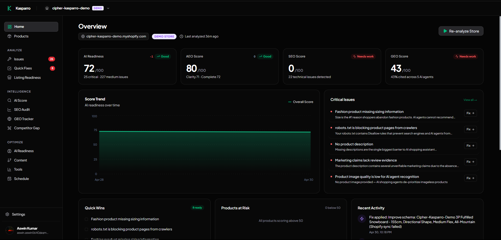

### 2. AI Readiness & Listing Readiness
Detailed breakdown of your AI representation score, tracking clarity, completeness, entity coverage, and structured data across your entire catalog.
<div align="center">
  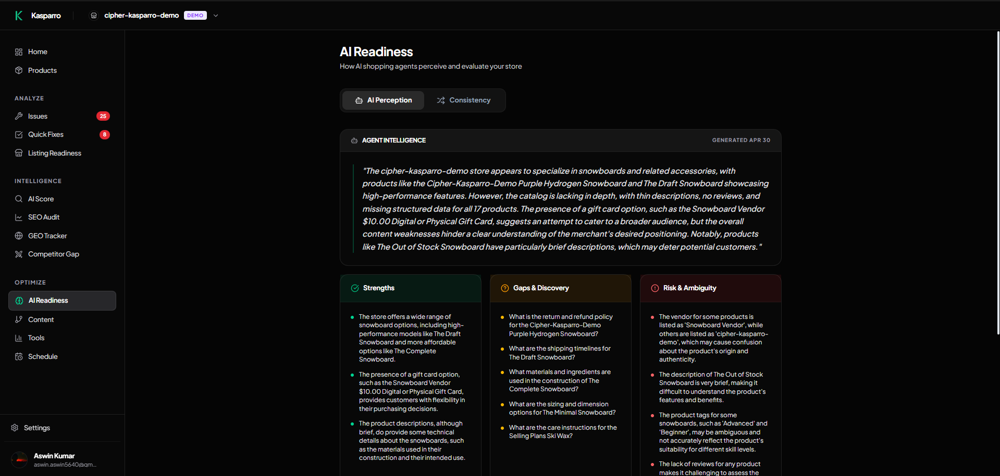
  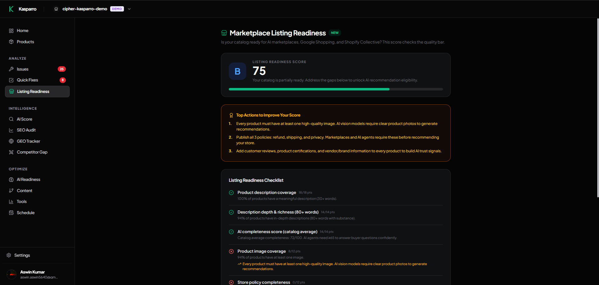
</div>

### 3. GEO (Generative Engine Optimization) Tracker
Live analysis of your store's performance across 5 different AI agents (Tavily, SerpAPI, Bedrock Nova, Claude 3, and Gemini).
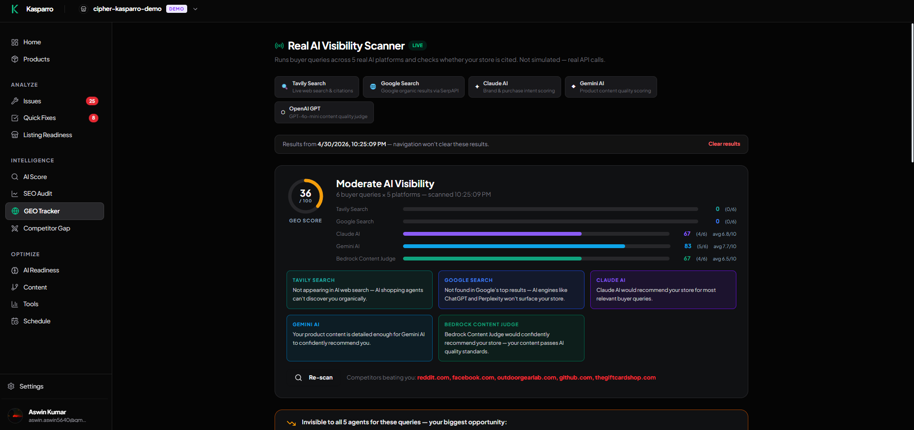

### 4. Products & Detailed View
Per-product report cards with specific, actionable steps to improve AI visibility.
<div align="center">
  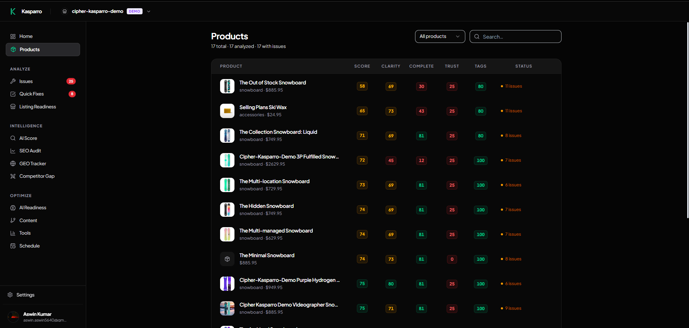
  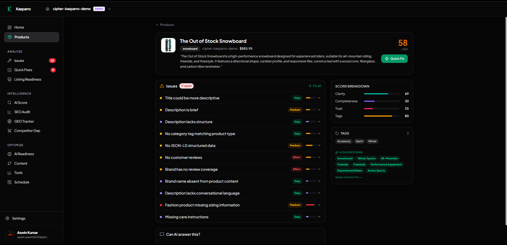
</div>

### 5. SEO Audit & Quick Fixes
Deterministic rule engine flagging missing descriptions, thin content, and absent pricing context, coupled with one-click AI-generated rewrites pushed directly to the Shopify Admin API.
<div align="center">
  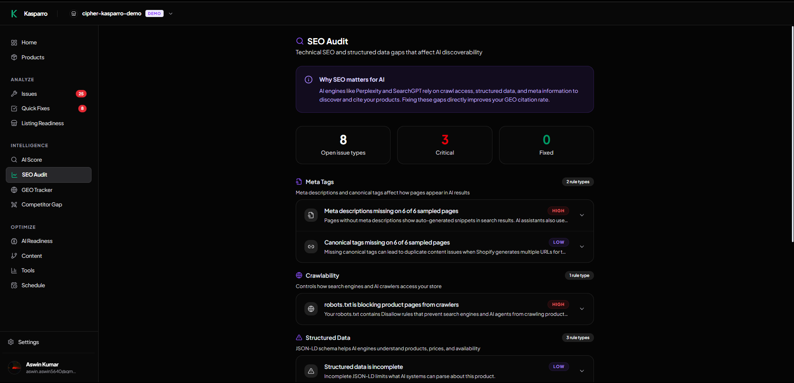
  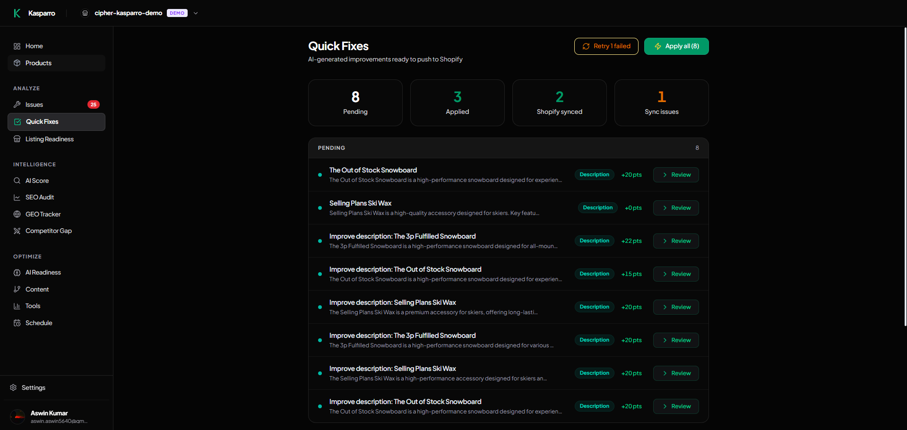
</div>

---

## ✨ Features

| Feature | Description |
|---|---|
| **AI Representation Score** | Composite 0–100 score across clarity, completeness, entity coverage, and structured data |
| **GEO Scanner** | 5-agent parallel scan across Tavily, SerpAPI, Bedrock Nova, Claude 3 Haiku, and Gemini |
| **Gap Analysis** | Deterministic rule engine that flags missing descriptions, thin content, absent pricing context |
| **One-Click Shopify Fixes** | AI-generated rewrites pushed directly to the Shopify Admin API — reviewed before applying |
| **Per-Product Report Card** | Listing-level breakdown with specific, actionable improvement steps |
| **AEO Score** | Answer Engine Optimization metric: likelihood an AI assistant cites your store unprompted |

---

## 🏗️ System Architecture

AIRO divides its operations logically between deterministic evaluations and AI-driven optimizations. The backend architecture consists of a high-performance Express server integrated with Neon PostgreSQL and an orchestrated AI execution layer.

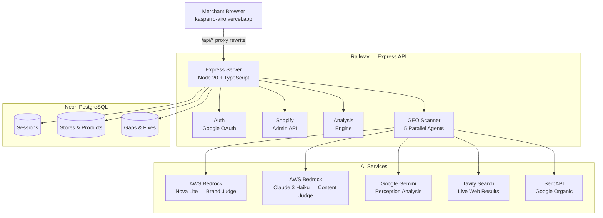

---

## 🤖 GEO Scanner — 5-Agent Pipeline

All 5 agents run in parallel. Each answers a different question about your store's AI visibility to determine a true generative engine optimization score.

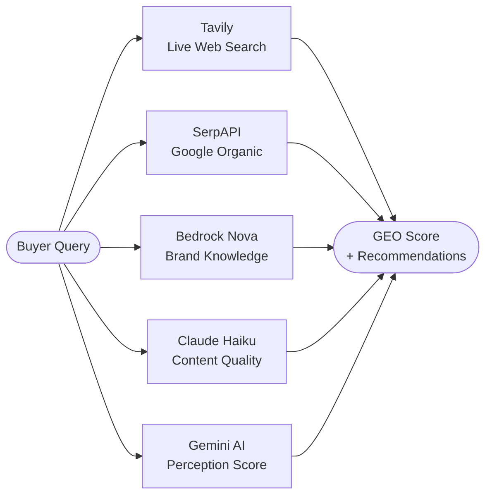

| Agent | Platform | What it measures |
|---|---|---|
| **Tavily** | Live web search | Whether your domain appears in AI retrieval sources |
| **SerpAPI** | Google Search | Top-10 organic ranking presence |
| **Nova Lite** | AWS Bedrock | Brand-level awareness baked into model training data |
| **Claude 3 Haiku** | AWS Bedrock | Product content quality for AI recommendation |
| **Gemini** | Google AI | Store perception and recommendation likelihood |

---

## ⚖️ AI vs Deterministic Boundary

Gap detection uses a **deterministic rule engine** — not an LLM — so every result is reproducible, auditable, and unit-testable. AI handles what only AI can do: writing better content and simulating how an agent perceives the store.

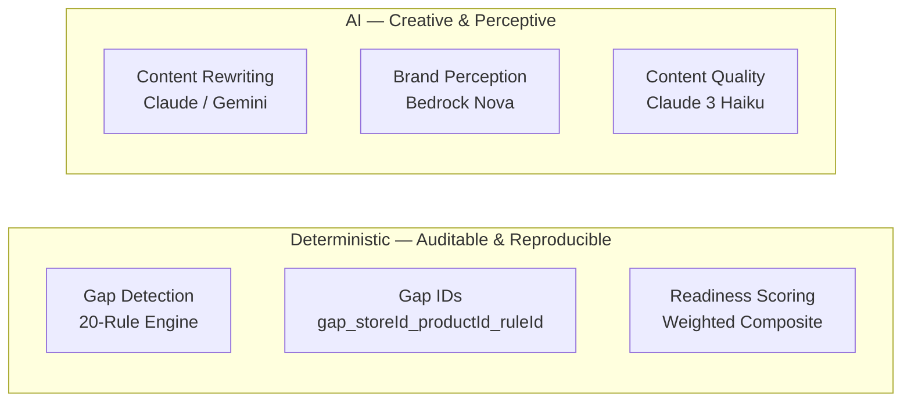

> **Note on Identifiers:** Gap IDs are highly deterministic (`gap_{storeId[-8]}_{productId[-8]}_{ruleId}`). The exact same violation on the exact same product always produces the identical ID. This enables perfect progress tracking without maintaining a massive, complex mapping table in the database.

---

## 🔄 CI/CD Workflow

AIRO utilizes an automated pipeline ensuring type-safety, rapid deployment, and isolated staging via GitHub Actions.

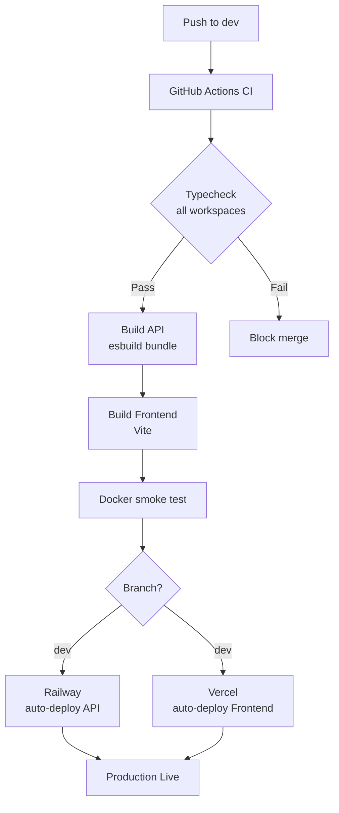

---

## 📂 Monorepo Structure

We use `pnpm` workspaces to manage our frontend, backend API, and shared logic layers cleanly.

```text
AIRO/
├── artifacts/
│   ├── api-server/              # Express API — Railway
│   │   ├── src/
│   │   │   ├── routes/          # auth, stores, products, gaps, shopify, geo
│   │   │   └── lib/             # geo-real.ts, ai-analyzer.ts, shopify-client.ts
│   │   ├── Dockerfile
│   │   └── build.mjs            # esbuild bundler
│   └── ai-readiness/            # React frontend — Vercel
│       ├── src/
│       │   ├── pages/           # landing, dashboard, geo, gaps, settings
│       │   └── context/         # auth-context, store-context
│       └── vercel.json          # proxy rewrites + security headers
├── lib/
│   ├── db/                      # Drizzle ORM schema + migrations
│   ├── api-zod/                 # Zod request/response schemas
│   └── api-client-react/        # React Query hooks (orval-generated)
├── DECISION_LOG.md
└── pnpm-workspace.yaml
```

---

## 🛠️ Tech Stack

### Frontend Architecture
| Technology | Version | Purpose |
|---|---|---|
| **React** | 19 | UI framework |
| **Vite** | 7 | Build tool & Development server |
| **Tailwind CSS** | 4 | Highly customizable utility-first styling |
| **Framer Motion** | 12 | Smooth, hardware-accelerated animations |
| **TanStack Query** | 5 | Asynchronous server state management |
| **Wouter** | — | Lightweight client-side routing |

### Backend Engineering
| Technology | Version | Purpose |
|---|---|---|
| **Node.js** | 20 | High-performance runtime environment |
| **Express** | 4 | Robust HTTP server |
| **Drizzle ORM** | 0.45 | Type-safe database queries and migrations |
| **Neon PostgreSQL** | — | Primary serverless database layer |
| **connect-pg-simple** | — | Secure session persistence |
| **esbuild** | 0.27 | Ultra-fast API bundler |

### AI & Data Infrastructure
| Service | Model | Role |
|---|---|---|
| **AWS Bedrock** | `apac.amazon.nova-lite-v1:0` | Brand knowledge perception agent |
| **AWS Bedrock** | `apac.anthropic.claude-3-haiku-20240307-v1:0` | Efficient content quality analysis judge |
| **Google Gemini** | `gemini-2.0-flash` | Deep perception and synthesis engine |
| **Tavily** | Search API | Live web context retrieval |
| **SerpAPI** | Google Search API | Accurate organic ranking signals |
| **OpenRouter / Groq** | — | Highly-available Gemini failover chains |

---

## 🚀 Setup Instructions

### Prerequisites

| Requirement | Version | Notes |
|---|---|---|
| Node.js | 20+ | `node --version` to verify |
| pnpm | 10+ | `npm install -g pnpm` |
| Shopify Partner account | — | [Create one here](https://partners.shopify.com/) — needs a development store |
| Google Cloud project | — | OAuth 2.0 credentials with `http://localhost:4000/api/auth/google/callback` as an authorized redirect URI |
| Neon database | — | Free tier is sufficient — copy the connection string |

---

### Step 1 — Clone and install

```bash
git clone https://github.com/Aswin-Kumar7/AIRO.git
cd AIRO
pnpm install
```

This installs all workspace packages (`api-server`, `ai-readiness`, `lib/db`, `lib/api-zod`, `lib/api-client-react`) in one pass.

---

### Step 2 — Configure environment variables

Create the API env file:

```bash
cp artifacts/api-server/.env.example artifacts/api-server/.env
```

Then fill in each section:

**`artifacts/api-server/.env`**

```env
# ── App ──────────────────────────────────────────────────────────────────────
NODE_ENV=development
PORT=4000
FRONTEND_URL=http://localhost:5173
APP_BASE_URL=http://localhost:4000

# ── Database ─────────────────────────────────────────────────────────────────
DATABASE_URL="YOUR_NEON_DATABASE_CONNECTION_STRING"

# ── Session & Encryption ─────────────────────────────────────────────────────
# Generate both with: node -e "console.log(require('crypto').randomBytes(32).toString('hex'))"
SESSION_SECRET=<64-char hex>
TOKEN_ENCRYPTION_KEY=<64-char hex>

# ── Shopify ───────────────────────────────────────────────────────────────────
# From your Shopify Partner dashboard → Apps → your app
SHOPIFY_API_KEY=...
SHOPIFY_API_SECRET=...
SHOPIFY_APP_URL=http://localhost:4000
SHOPIFY_SCOPES=read_products,write_products,read_content,write_content

# ── Google OAuth ─────────────────────────────────────────────────────────────
# From Google Cloud Console → APIs & Services → Credentials
GOOGLE_CLIENT_ID=...
GOOGLE_CLIENT_SECRET=...
GOOGLE_REDIRECT_URI=http://localhost:4000/api/auth/google/callback

# ── AI Services ──────────────────────────────────────────────────────────────
# AWS Bedrock: create an IAM user with BedrockFullAccess, then generate an API key
BEDROCK_API_KEY=...
AWS_REGION=ap-south-1
BEDROCK_MODEL_ID=apac.amazon.nova-lite-v1:0
BEDROCK_CONTENT_MODEL_ID=apac.anthropic.claude-3-haiku-20240307-v1:0

# Google AI Studio → Get API Key
GEMINI_API_KEY=...

# tavily.com → Dashboard → API Keys
TAVILY_API_KEY=...

# serpapi.com → Dashboard → API Key
SERPAPI_API_KEY=...

# Optional: fallback chain for Gemini if quota is exceeded
OPENROUTER_API_KEY=...
GROQ_API_KEY=...

# ── Email (optional) ─────────────────────────────────────────────────────────
RESEND_API_KEY=...
EMAIL_FROM=noreply@yourdomain.com
```

**`artifacts/ai-readiness/.env`** (frontend only needs one variable locally):

```env
VITE_API_URL=http://localhost:4000
```

> **Production note:** On Vercel, leave `VITE_API_URL` unset. The `vercel.json` proxy rewrite handles all `/api/*` calls automatically.

---

### Step 3 — Run migrations

```bash
pnpm migrate
```

This runs Drizzle migrations against your Neon database. The `session` table is auto-created on first server startup.

---

### Step 4 — Start development servers

Open two terminals:

```bash
# Terminal 1 — API (http://localhost:4000)
pnpm --filter @workspace/api-server run dev

# Terminal 2 — Frontend (http://localhost:5173)
pnpm --filter @workspace/ai-readiness run dev
```

The frontend proxies `/api/*` to `localhost:4000` in development via Vite's dev server config, so session cookies work same-origin locally too.

---

## ☁️ Deployment

| Layer | Platform | External URL |
|---|---|---|
| **Frontend** | Vercel | [kasparro-airo.vercel.app](https://kasparro-airo.vercel.app) |
| **API Backend** | Railway | [api-airo.up.railway.app](https://api-airo.up.railway.app) |
| **Database** | Neon | `ap-southeast-1` region (Serverless PostgreSQL) |

### Railway (API)
1. Connect repository branch: `dev`
2. Dockerfile path: `artifacts/api-server/Dockerfile`
3. Public port: `4000`
4. Add all environment variables. Railway handles auto-deployments on git push.

### Vercel (Frontend)
1. Connect repository branch: `dev`
2. Root directory: `artifacts/ai-readiness`
3. Build command: `cd ../.. && pnpm --filter @workspace/ai-readiness run build`
4. Install command: `cd ../.. && pnpm install --frozen-lockfile`
5. Output directory: `dist/public`
6. Leave `VITE_API_URL` unset — `vercel.json` proxies `/api/*` to Railway automatically.

*(Note: Session cookies work perfectly in this setup because the Vercel proxy rewrite makes all API calls appear same-origin. No complex `SameSite=None` browser workarounds are needed.)*

---

## 🔒 Security

| Concern | Implementation Detail |
|---|---|
| **Token storage** | AES-256-GCM application-level encryption for all sensitive keys. |
| **CSRF** | Handled by `csrf-sync` — secure tokens validated on all mutating endpoints. |
| **Sessions** | `express-session` backed securely by `connect-pg-simple` within Neon PostgreSQL. |
| **Cross-origin cookies** | Avoided completely. Vercel's proxy rewrite treats cookies natively as first-party. |
| **Secret validation** | Strict runtime validation; missing `SESSION_SECRET` in production triggers an immediate fast-fail at startup. |
| **Transport** | Strict HTTPS enforcement maintained via Railway edge network + Vercel's edge caching layer. |

---

## 🤝 Contribution Note

**Team Cipher**

- **Aswin Kumar (Engineering Lead)**: Led backend architecture, database schema design, and cloud infrastructure integration. Built the robust Express API using Drizzle ORM and Neon, while engineering the highly complex 5-agent GEO parallel scanner. Integrated directly with Shopify Admin API, handled complex AI orchestration with AWS Bedrock, Google Gemini, and automated the deterministic gap engine pipeline. Oversaw full CI/CD deployment automation (Railway, Vercel, GitHub Actions).
- **Naveen (Product & Frontend Lead)**: Spearheaded initial product validation, feature ideation, and user mapping for merchants. Defined the distinct dashboard metrics and guided aesthetic execution. Implemented the beautiful, high-performance UI flows (React, Tailwind CSS, Framer Motion), built the stunning product landing page, constructed data-dense dashboard views, and aggressively led QA iterations to maintain an exceptionally high standard of user experience.

---

## 📄 Decisions & License

All significant architectural, scoping, and infrastructure decisions can be found in our comprehensive **[DECISION_LOG.md](./DECISION_LOG.md)**.

<div align="center">

Built for the **Kasparro Agentic Commerce Hackathon**

[](https://shopify.dev/)
[](https://anthropic.com/)
[](https://aws.amazon.com/bedrock/)
[](https://deepmind.google/technologies/gemini/)
[](https://neon.tech/)

</div>
