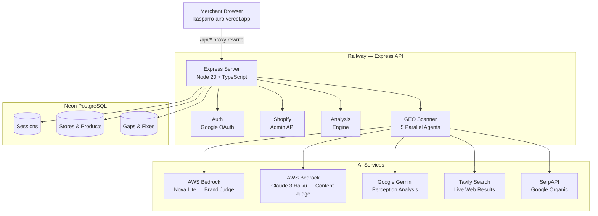
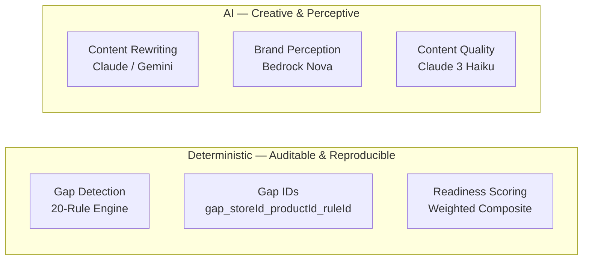
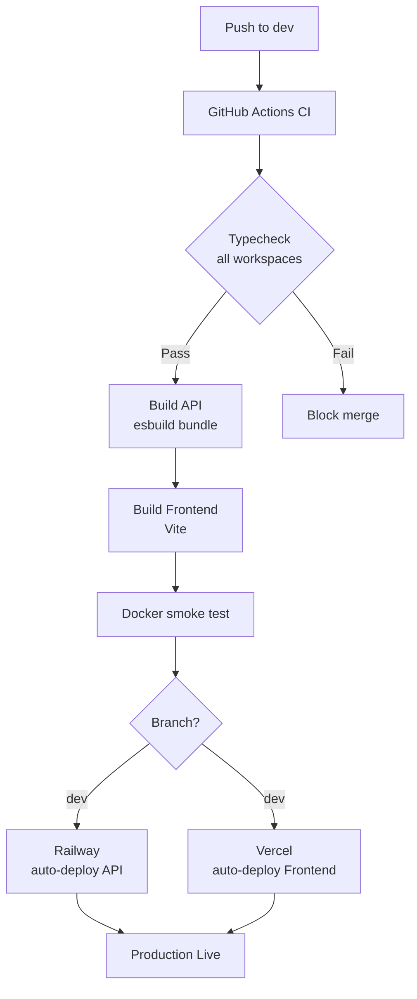

<div align="center">

# AIRO — AI Representation Optimizer

**Make your Shopify store visible to AI shopping agents before your competitors do.**

<br/>

[](https://www.typescriptlang.org/)
[](https://react.dev/)
[](https://nodejs.org/)
[](https://shopify.dev/)

[](https://aws.amazon.com/bedrock/)
[](https://anthropic.com/)
[](https://deepmind.google/technologies/gemini/)
[](https://neon.tech/)

[](https://railway.app/)
[](https://vercel.com/)
[](https://github.com/features/actions)

<br/>

[**Live Demo**](https://kasparro-airo.vercel.app) &nbsp;·&nbsp; [**API Health**](https://api-airo.up.railway.app/api/healthz) &nbsp;·&nbsp; [**Decision Log**](./DECISION_LOG.md)

<br/>

> *Built for the **Kasparro Agentic Commerce Hackathon** · April 2026*

</div>

---

## What is AIRO?

AI shopping assistants — ChatGPT, Gemini, Claude, Perplexity — are answering product queries directly. They don't rank pages; they cite stores whose content they can understand and trust.

AIRO analyzes every product in your Shopify catalog through five AI platforms simultaneously, scores what's missing, generates targeted fixes, and syncs improvements back to Shopify in one click — no code, no developer, no guesswork.

---

## Features

| Feature | Description |
|---|---|
| **AI Representation Score** | Composite 0–100 score across clarity, completeness, entity coverage, and structured data |
| **GEO Scanner** | 5-agent parallel scan across Tavily, SerpAPI, Bedrock Nova, Claude 3 Haiku, and Gemini |
| **Gap Analysis** | Deterministic rule engine that flags missing descriptions, thin content, absent pricing context |
| **One-Click Shopify Fixes** | AI-generated rewrites pushed directly to the Shopify Admin API — reviewed before applying |
| **Per-Product Report Card** | Listing-level breakdown with specific, actionable improvement steps |
| **AEO Score** | Answer Engine Optimization metric: likelihood an AI assistant cites your store unprompted |

---

## System Architecture



---

## GEO Scanner — 5-Agent Pipeline


All 5 agents run in parallel. Each answers a different question about your store's AI visibility.

| Agent | Platform | What it measures |
|---|---|---|
| Tavily | Live web search | Whether your domain appears in AI retrieval sources |
| SerpAPI | Google Search | Top-10 organic ranking presence |
| Nova Lite | AWS Bedrock | Brand-level awareness baked into model training data |
| Claude 3 Haiku | AWS Bedrock | Product content quality for AI recommendation |
| Gemini | Google AI | Store perception and recommendation likelihood |

---

## AI vs Deterministic Boundary



Gap detection uses a deterministic rule engine — not an LLM — so every result is reproducible, auditable, and unit-testable. AI handles what only AI can do: writing better content and simulating how an agent perceives the store.

Gap IDs are deterministic: `gap_{storeId[-8]}_{productId[-8]}_{ruleId}` — the same violation on the same product always produces the same ID, enabling progress tracking without a separate mapping table.

---

## CI/CD Workflow



---

## Monorepo Structure

```
AIRO/
├── artifacts/
│   ├── api-server/              # Express API — Railway
│   │   ├── src/
│   │   │   ├── routes/          # auth, stores, products, gaps, shopify, geo
│   │   │   └── lib/             # geo-real.ts, ai-analyzer.ts, shopify-client.ts
│   │   ├── Dockerfile
│   │   └── build.mjs            # esbuild bundler
│   └── ai-readiness/            # React frontend — Vercel
│       ├── src/
│       │   ├── pages/           # landing, dashboard, geo, gaps, settings
│       │   └── context/         # auth-context, store-context
│       └── vercel.json          # proxy rewrites + security headers
├── lib/
│   ├── db/                      # Drizzle ORM schema + migrations
│   ├── api-zod/                 # Zod request/response schemas
│   └── api-client-react/        # React Query hooks (orval-generated)
├── DECISION_LOG.md
└── pnpm-workspace.yaml
```

---

## Tech Stack

### Frontend

| Technology | Version | Purpose |
|---|---|---|
| React | 19 | UI framework |
| Vite | 7 | Build tool |
| Tailwind CSS | 4 | Styling |
| Framer Motion | 12 | Animations |
| TanStack Query | 5 | Server state |
| Wouter | — | Client-side routing |

### Backend

| Technology | Version | Purpose |
|---|---|---|
| Node.js | 20 | Runtime |
| Express | 4 | HTTP server |
| Drizzle ORM | 0.45 | Database queries |
| Neon PostgreSQL | — | Primary database |
| connect-pg-simple | — | Session persistence |
| esbuild | 0.27 | API bundler |

### AI & Data Services

| Service | Model | Role |
|---|---|---|
| AWS Bedrock | `apac.amazon.nova-lite-v1:0` | Brand knowledge agent |
| AWS Bedrock | `apac.anthropic.claude-3-haiku-20240307-v1:0` | Content quality judge |
| Google Gemini | `gemini-2.0-flash` | Perception analysis |
| Tavily | Search API | Live web retrieval |
| SerpAPI | Google Search API | Organic ranking signals |
| OpenRouter + Groq | — | Gemini failover chain |

---

## Local Development

### Prerequisites

- Node.js 20+, pnpm 10+
- Shopify Partner account + development store
- Google OAuth credentials
- Neon database URL

### Setup

```bash
git clone https://github.com/Aswin-Kumar7/AIRO.git
cd AIRO
pnpm install
cp artifacts/api-server/.env.example artifacts/api-server/.env
# fill in your values
pnpm migrate
pnpm --filter @workspace/api-server run dev   # port 4000
pnpm --filter @workspace/ai-readiness run dev # port 5173
```

### Environment Variables

**API Server** (`artifacts/api-server/.env`):

```env
NODE_ENV=development
PORT=4000
DATABASE_URL=postgresql://...
SESSION_SECRET=          # node -e "console.log(require('crypto').randomBytes(32).toString('hex'))"
TOKEN_ENCRYPTION_KEY=    # same command

SHOPIFY_API_KEY=...
SHOPIFY_API_SECRET=...
SHOPIFY_APP_URL=http://localhost:4000
SHOPIFY_SCOPES=read_products,write_products,read_content,write_content

GOOGLE_CLIENT_ID=...
GOOGLE_CLIENT_SECRET=...
GOOGLE_REDIRECT_URI=http://localhost:4000/api/auth/google/callback

BEDROCK_API_KEY=...
AWS_REGION=ap-south-1
BEDROCK_MODEL_ID=apac.amazon.nova-lite-v1:0
BEDROCK_CONTENT_MODEL_ID=apac.anthropic.claude-3-haiku-20240307-v1:0
GEMINI_API_KEY=...
TAVILY_API_KEY=...
SERPAPI_API_KEY=...
OPENROUTER_API_KEY=...
GROQ_API_KEY=...

RESEND_API_KEY=...
EMAIL_FROM=noreply@yourdomain.com
FRONTEND_URL=http://localhost:5173
APP_BASE_URL=http://localhost:4000
```

**Frontend** (`artifacts/ai-readiness/.env`):

```env
VITE_API_URL=http://localhost:4000
```

---

## Deployment

| Layer | Platform | URL |
|---|---|---|
| Frontend | Vercel | [kasparro-airo.vercel.app](https://kasparro-airo.vercel.app) |
| API | Railway | [api-airo.up.railway.app](https://api-airo.up.railway.app) |
| Database | Neon | `ap-southeast-1` region |

### Railway (API)

1. Connect repo → branch: `dev`
2. Dockerfile path: `artifacts/api-server/Dockerfile`
3. Public port: `4000`
4. Add all env vars — Railway auto-deploys on push

### Vercel (Frontend)

1. Connect repo → branch: `dev`
2. Root directory: `artifacts/ai-readiness`
3. Build command: `cd ../.. && pnpm --filter @workspace/ai-readiness run build`
4. Install command: `cd ../.. && pnpm install --frozen-lockfile`
5. Output directory: `dist/public`
6. Leave `VITE_API_URL` unset — `vercel.json` proxies `/api/*` to Railway automatically

Session cookies work because the Vercel proxy makes all API calls appear same-origin. No `SameSite=None` workarounds needed.

---

## Security

| Concern | Implementation |
|---|---|
| Token storage | AES-256-GCM application-level encryption |
| CSRF | `csrf-sync` — token validated on all mutating endpoints |
| Sessions | `express-session` + `connect-pg-simple` backed by Neon |
| Cross-origin cookies | Vercel proxy rewrite — cookies are first-party |
| Secret validation | Missing `SESSION_SECRET` in production throws at startup |
| Transport | HTTPS enforced via Railway + Vercel edge |

---

## Team

| Contributor | Role |
|---|---|
| **Aswin Kumar** | Engineering lead — monorepo architecture, Express API, GEO scanner pipeline, Shopify integration, AI model integration (Bedrock, Gemini, Tavily, SerpAPI), infrastructure (Railway, Vercel, Neon), CI/CD, deterministic gap engine, scoring model design |
| **Naveen** | Product and frontend — merchant user journey, competitive analysis, go-to-market framing, frontend UI flows, landing page, UX feedback |

---

## Decision Log

All significant architectural and product decisions are in **[DECISION_LOG.md](./DECISION_LOG.md)** — covering infrastructure choices, AI model selection, scope tradeoffs, and security design.

---

## License

MIT © 2026 Aswin Kumar

---

<div align="center">

Built for the **Kasparro Agentic Commerce Hackathon**

[](https://shopify.dev/)
[](https://anthropic.com/)
[](https://aws.amazon.com/bedrock/)
[](https://deepmind.google/technologies/gemini/)
[](https://neon.tech/)

</div>
